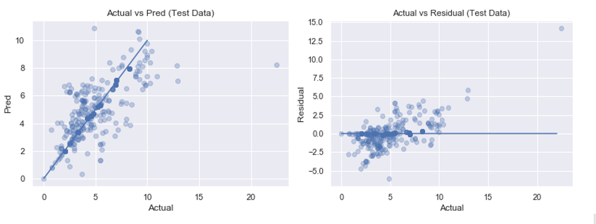

# Predicting NYC Office Rental Price
I'm interested in building a model to predict how much commercial office costs in New York. 
   
To start with, there are a few questions I want to seek answers from the model:

- Does location really matter?
- Does the size of the space matter?
- Will it charge less if tenants plan to rent for longer term?
- Will available amenities onsite, such as common kitechen and 24/7 security, increase the price?

## Data Collection & Pre-Processing
I scraped available commercial office listins from 42floors.com using **Selenium** and **BeautifulSoup**, and got 3532 results back. Web scraping pipeline can be found in [pull-list-of-links.ipynb](./code/1-pull-list-of-links.ipynb) and [scrape-data-from-link-linst.ipynb](./code/2-scrape-data-from-link-lists.ipynb).

Since listings are updated everyday, this is the highest number of unique listings I could get. Half of the listings do not have a listing price, which is the target that the model is predicting, I ended up with 1760 valid observations. Even though the final dataset is not huge,it is still statistically sufficient to capture representative regression patterns.  

Description of features collected from scrapping:
- **Rate** : _[numeric]_ the target that model is predicting (_Y_)
- **Listing Title** : _[text]_ data with building information
- **Address** : _[text]_ data with street, city, and zipcode
- **Posting Date** : _[datetime]_
- **SqFt** : _[numeric]_
- **Floor Level** : _[numeric]_
- **Construct Year** : _[numeric]_
- **Renovation Year** : _[numeric]_
- **Nearby Public Transition** : _[text]_ Metro station lines and bus stations nearby 
- **Building Class** : _[category]_ ratings ranges from class A, class B, class C, class D
- **Amenities**: _[binary]_
    <ul>
    <li>Common Kitchen</li>
    <li>Shower</li>
    <li>Key Card Access</li>
    <li>Onsite Security</li>
    <li>High Ceilings</li>
    <li>Plug and Play</li>
    </ul>
- **Term Length** : _[text]_ ranges from a few months to a few years

Prices listed on 42floors.com varies, including _sqft/mo_, _sqft/yr_, _per month_, and _per year_. For consistency, I converted all price rate to _sqft/mo_.

## Feature Engineering & Modeling
I started with simple regression model with available numerical and categorical features, which can give me a baseline to testify whether additional features engineered bring value to the model. The dataset is split into 60% training, 20% validation, and 20% testing. The first model seems to capture too much noice, so I decided to **remove price outliers**. Unfortunately, the linear regression model returns negative R² on validation data, which means regression should not be linear.

Then I _generated month names_ (i.e. January, Feburary etc) and _Days from Listings_ from _Posting Date_. I extracted **Inverse** features _1/SQFT_ and _1/Nearby Public Transition_ and **Polynomial** feature _square on _Days From Listing__ by observing distributions of numeric features, and run linear regression again. 

Finally, I added *Interaction* features _sqft_x_listingDays_ and _sqft_x_transit_ and passed all to the regression model. 

## Results 
Below is the final R² score of linear regression model after a few rounds of feature engineering. 
|   Model    |      R² |
|------------|---------|
|Validation  |  0.5227 |
|   Test     |  0.5082 |

To visualize how well the model does, I have created **Actual VS Prediction** (left) and **Residual** plot (right). Since the input has been scaled, axises do not reflect the original price range.   
 

## Insights
1. **Square feet** in this case is *not an important factor* on rental prices.
2. Offices listed in **August** charges the higheest during the year.
3. If the space have **Common Kitchen**, tends to charges $467 more every month.
4. Buildings made of **Glass** or **Concrete**, which are popular in the recent decades, charge lowest rate.
5. Buildings on **8th Avenue and 23rd St, Manhattan NY** chargest higher than other areas.

## Next Step
Some additional features may have great contribution into the model.   
For example:
- How many restaurants/Cafe/shops are nearby in walking distance?
- Is onsite parking available? For what rate?
- Any late fees for delayed payments?
- What's the building renewal policy? Is subleasing allowed?
- Does building provide general maintenance?
